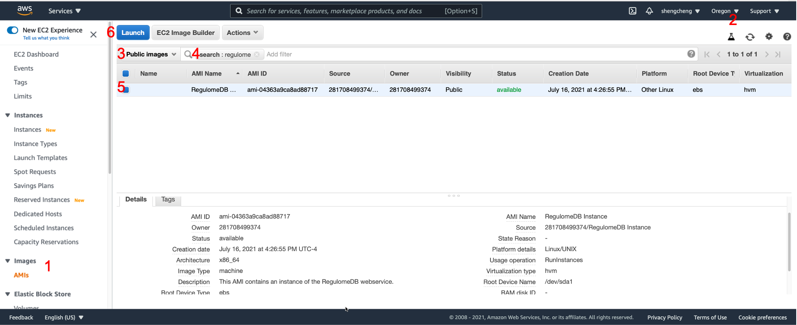

# TURF: Prioritization of regulatory variants with tissue-specific function

TURF (Tissue-specific Unified Regulatory Features) is built on the RegulomeDB framework to prioritize regulatory variants in the non-coding regions of the human genome. It leverages information from functional genomics assays and provides prediction scores in both generic and tissue-specific/organ-specific contexts.

## If you use TURF, please cite:

Dong, S., & Boyle, A. P. (2021). Prioritization of regulatory variants with tissue-specific function in the non-coding regions of human genome. https://doi.org/10.1101/2021.03.09.434619 (To be updated)

## Demo

We included a demo to generate TURF generic and organ-specific scores in 51 ENCODE organs.

```
cd Demo
python predict_TURF.py example_json.txt example.bed organ_list.txt example_predictions.txt
```

### Usage
```
python predict_TURF.py input_json input_bed query_organ_list output_predictions
```

### Input files:
* ```input_json```: A file with an json object on each line for each query variant, which contains the information of assays overlapping the variant position queried through RegulomeDB. This can be retrieved from the RegulomeDB web server (for example: https://regulomedb.org/regulome-search/?regions=chr1:39492461-39492462&genome=GRCh37&format=json). The example we included here is the trimmed json objects with only the information we need for generating features in TURF models.

* ```input_bed```: A bed file containing the positions and genotypes for each query variant. The columns are chromosome, start, end, ref, alt.

* ```query_organ_list```: The list of query organs for TURF organ-specific scores (```organ_list.txt```contains the 51 ENCODE organs with available organ-specific features that we included in our paper).

### Other required files:
* ```Precalculated_features/```: This includes the bigwig files for all precalculated features we used in TURF generic scores (IC_change, IC_matched_change, funsig and ChIP signals). For funsig from DeepSEA ([Zhou and Troyanskaya 2015](https://www.nature.com/articles/nmeth.3547)), we calculated each of the three possible nucleotide changes on every genome position within the union set of DNase-seq peaks (ENOCDE 2012), as well as all 1000 Genome project phase3 variants. There is also an SQL database containing all histone mark ChIP-seq peak files from ENCODE 2019 which is used for calculating TURF organ-specific scores. **You will need to download here: [Precalculated_features/](https://drive.google.com/drive/folders/11cFBCjvHniwsY5fO17jHxj_GcOa-llaJ?usp=sharing)**.

* ```biosample_organ.txt```: Each line is a mapping from biosample name to its relevant organ(s) downloaded from ENCODE website: https://www.encodeproject.org/report/?type=BiosampleType.

### Output file:
* ```example_predictions.txt```: The predictions of TURF generic and organ-specific scores, with a header explaining each column.

**Note:** We are integrating TURF pipeline into the interface of RegulomeDB web server, including all precalculated features as well as constant updates on histone mark ChIP-seq datasets.

## AMI (Amazon Machine Image) for RegulomeDB query

We have set up a public AMI for RegulomeDB, available on `us-west-2` Oregon. You will need a `t3.2xlarge` size instance at minimum to support the elasticsearch for RegulomeDB database. 

The RegulomeDB AMI can be found under aws [EC2 service](https://aws.amazon.com/ec2/?ec2-whats-new.sort-by=item.additionalFields.postDateTime&ec2-whats-new.sort-order=desc):
1. Go to **AMIs** under Images.
2. Set region as **Oregon**.
3. Select **Public images**.
4. Search either by **'regulome'**, or by AMI ID **'ami-04363a9ca8ad88717'**.
5. You will then see the AMI here.
6. Click **Launch** for you own instance.

### Query variants from AMI
You can use a python script for querying a set of input variants. Help messages can be found by:
```
bin/regulome-search -h
```
#### Example
```
bin/regulome-search -f /home/ubuntu/example/example.bed --peak > example_json.txt
```
This will generate the example input json file for scoring, you can then use `predict_TURF.py` to generate TURF scores as shown in the Demo part above.

## Other available files
* Precalculated TURF generic scores and organ-specific scores on 51 ENCODE organs for **GWAS variants** from GWAS Catalog after LD expansion (with R<sup>2</sup> threshold of 0.6) are under `GWAS_variants/`.

* All ASB SNVs and MPRA variants used for training and evaluation are under `Training/`. The script used to train the final TURF models `train_TURF_ASB.py` is under `Final_models/`. We included the following features on each column as described in Supplemental Table S2:


| Column name       | Description |
| :----------- | :----------- |
| **Generic features** ||
| CHIP      | TF binding sites from ChIP-seq|
| DNASE   | DNase I hypersensitive sites from DNase-seq|
| PWM   | TF motifs from PWM matching|
| FOOTPRINT   | DNase footprints|
| EQTL_2   |eQTLs|
| PWM_matched   | DNase footprints with matched TF ChIP-seq peaks|
| FOOTPRINT_matched | TF motifs from PWM matching with matched TF ChIP-seq peaks|
| IC_change | Information content change of two alleles in PWM matching|
| IC_matched_change | Information content change of two alleles in PWM matching with matched TF ChIP-seq peaks        |
| funsig |Functional significance score from [DeepSEA](https://www.nature.com/articles/nmeth.3547)      |
| ChIP_quantile1,ChIP_quantile2,ChIP_quantile3,ChIP_max,ChIP_var   |Quantiles (25%,50%,75% and 100%) and variance of ChIP-seq signals across all available ChIP-seq experiments from ENCODE       |
| **Tissue-specific features** ||
|H3K4me1_tissueSp|H3K4me1 peaks from ChIP-seq|
|H3K4me3_tissueSp|H3K4me3 peaks from ChIP-seq|
|H3K27ac_tissueSp|H3K27ac peaks from ChIP-seq|
|H3K36me3_tissueSp|H3K36me3 peaks from ChIP-seq|
|H3K27me3_tissueSp|H3K27me3 peaks from ChIP-seq|
|DNASE_tissueSp|DNase I hypersensitive sites from DNase-seq|
|FOOTPRINT_tissueSp|DNase footprints|
